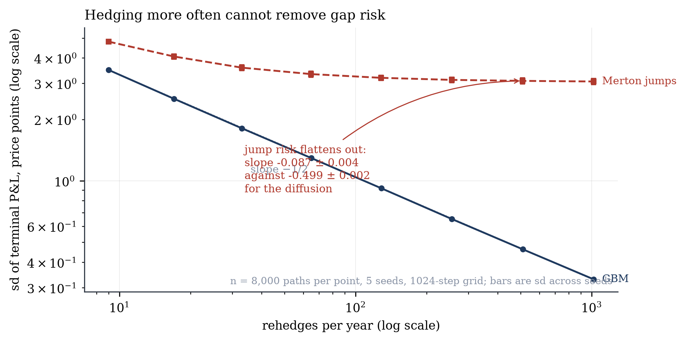

# vol-lab

A terminal laboratory for the three questions an options market maker answers every
day: what does it cost me to hedge, is my surface a set of real prices, and where do I
quote?

- **hedge** - what is my P&L if I sell an option and delta hedge it, and how does it
  change with hedging frequency, transaction costs, and the process the underlying
  actually follows?
- **surface** - does my fitted smile imply a probability distribution, or does it
  quietly price butterflies negative?
- **mm** - how hard should quotes lean against inventory?

Every finding below is produced by a test that fails if the engine is wrong, and by a
command you can run yourself. The full write-up, including the jump floor and the
schedule comparison, is in [REPORT.md](REPORT.md).

## Findings

Seven findings, each with a test that fails if the engine is wrong and a command that
regenerates it. Numbers below are means over 5 seeds; the full write-up with
uncertainties, figures and stated limitations is in [REPORT.md](REPORT.md).

| | finding | headline |
|---|---|---|
| 1 | Hedging error falls as the inverse square root of frequency | slope **-0.4987 +/- 0.0024** against theory -0.5 |
| 2 | Hedging at realized vol locks in the edge; at implied it earns the same mean far less reliably | same mean, several times the dispersion |
| 3 | The P&L explain closes; the residual measures what hedging cannot see | residual is third order, halving per fourfold refinement |
| 4 | Jumps floor the hedging error at a level frequency cannot reach | GBM **-0.499**, Merton **-0.087** |
| 5 | Under costs the optimum is a band, not a frequency | the band trades far less for a better mean |
| 6 | An unconstrained smile fit implies negative probabilities | up to 12 of 30 fits, removed at a cost of 0.08 vol points |
| 7 | Inventory skew halves a market maker's P&L dispersion | interior optimum, separated by 6+ standard errors |

Two numerical results worth their own line: a control variate derived from finding 1
(`sum(z^2-1)`) cuts estimator variance to **0.35**, while the textbook choice
of the terminal payoff correlates at only -0.030 and buys nothing, and
antithetic sampling provably cannot help at all because the hedging error is even in the
driving normal.



## Run it

```sh
uv sync
uv run vl price --K 100 --T 1 --vol 0.3         # Black-Scholes price and greeks
uv run vl register configs/discretisation.toml  # stamp a config with its hash
uv run vl run configs/discretisation.toml       # run it, chart it, record it
uv run vl bench                                 # NumPy reference against C++
uv run vl surface --noise 1.5                   # fit a smile, check it for arbitrage
uv run vl mm --gam 0.1                          # quote with and without inventory skew
uv run vl view                                  # browse recorded runs
uv run pytest                                   # 328 tests
uv run python scripts/report.py                 # regenerates every number
uv run python scripts/render_report.py          # fills REPORT.md
uv run python scripts/figures.py                # redraws figures/
```

Every number in REPORT.md comes from `artifacts/findings.json`, which `scripts/report.py`
writes and CI checks. Nothing in the report is typed by hand.

Editing C++ needs `uv sync --reinstall-package vollab`; the editable rebuild hook is
off deliberately, and `pyproject.toml` records why.

## How it stays honest

A config file carries its own hash. Editing a parameter without re-registering blocks
the run, so the hypothesis is fixed before the number exists. Every run writes a row
recording the config hash, the git commit, whether the tree was dirty, the RNG scheme
version and the library versions. `vl compare` refuses a paired bootstrap between two
runs that did not share paths, because that comparison would be silently wrong.

You own the database, so none of this is security. It is friction, plus an honest
record of what was actually tried.

## Design notes

**Randomness is counter-based.** Paths are keyed by `(seed, path_index)` through a
Philox generator. The key is exactly two 64-bit words, so the step index lives in the
counter rather than the key, and `advance()` is never used because it moves whole
four-output blocks and would silently stride the stream.

**Paths are always generated on the finest grid.** Coarser rehedge frequencies
subsample it, so every frequency in a sweep runs on identical Brownian-nested paths.
An unpaired sweep would widen the error on the fitted slope considerably.

**Two volatilities, never one symbol.** The option is marked at `s_imp`; the traded
hedge is sized at `s_hedge`. They differ whenever F2 is the experiment, so the code
names them `delta_mark` and `delta_hedge` and never conflates them.

**The engine never falls back.** Asking for an engine that is not built raises rather
than quietly running the other one, so a future parity test cannot pass by comparing
an engine against itself.

## Status

All three modules built.

| module | what it does |
|--------|--------------|
| `hedge` | NumPy and C++ engines under tiered parity; GBM, Heston and Merton, each gated by an independent ground-truth price; four hedging schedules; a full P&L explain |
| `surface` | Quasi-explicit SVI calibration under Durrleman, Lee and calendar constraints, with the implied density plotted |
| `mm` | Avellaneda-Stoikov quoting against a never-skewed control on identical paths |

Every finding is in [REPORT.md](REPORT.md), each with a test that fails if the engine
is wrong and a command that regenerates it.

## References

- Boyle, P. and Emanuel, D. (1980). Discretely adjusted option hedges.
- Leland, H. (1985). Option pricing and replication with transactions costs.
- Whalley, A. E. and Wilmott, P. (1997). An asymptotic analysis of an optimal hedging model for option pricing with transaction costs.
- Ahmad, R. and Wilmott, P. (2005). Which free lunch would you like today, sir?
