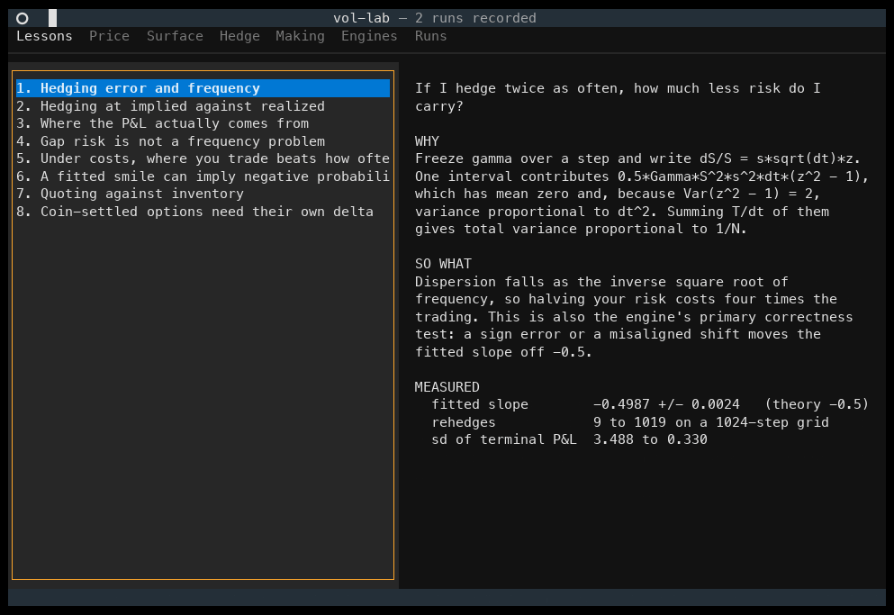

# vol-lab

A terminal laboratory for the three questions an options market maker answers every
day: what does it cost me to hedge, is my surface a set of real prices, and where do I
quote?

- **hedge** - what is my P&L if I sell an option and delta hedge it, and how does it
  change with hedging frequency, transaction costs, and the process the underlying
  actually follows, including one whose volatility is rough?
- **surface** - does my fitted smile imply a probability distribution, or does it
  quietly price butterflies negative?
- **mm** - how hard should quotes lean against inventory, what does it cost to go home
  flat, and does any of it protect against informed flow?

Every finding below is produced by a test that fails if the engine is wrong, and by a
command you can run yourself. The full write-up, including the jump floor and the
schedule comparison, is in [REPORT.md](REPORT.md).



`vl view` is the whole lab in one panel: the thirteen findings with the numbers that were
actually measured, then the tools that produced them. Charts are sized to the window,
so the numbers under a chart stay on screen. The recording is produced by
`scripts/record_view.py` from the keys the panel binds, so it cannot drift into
advertising a control that no longer exists.

## Findings

Thirteen findings, each with a test that fails if the engine is wrong and a command that
regenerates it. Numbers below are means over 5 seeds; the full write-up with
uncertainties, figures and stated limitations is in [REPORT.md](REPORT.md).

| | finding | headline |
|---|---|---|
| 1 | Hedging error falls as the inverse square root of frequency | slope **-0.4987 +/- 0.0024** against theory -0.5 |
| 2 | Hedging at realized vol locks in the edge; at implied it earns the same mean far less reliably | same mean, several times the dispersion |
| 3 | The P&L explain closes; the residual measures what hedging cannot see | residual is third order, halving per fourfold refinement |
| 4 | Jumps floor the hedging error at a level frequency cannot reach | GBM **-0.499**, Merton **-0.087** |
| 5 | Under costs the optimum is a band, not a frequency | the band trades far less for a better mean |
| 6 | An unconstrained smile fit implies negative probabilities | up to 12 of 30 fits, removed at a cost of 0.08 vol points |
| 7 | Inventory skew halves a market maker's P&L dispersion, and the horizon term costs real money | the steady-state form keeps improving where Avellaneda-Stoikov collapses |
| 8 | Coin-settled options need their own delta | a converted vanilla delta is wrong by up to **53%** |
| 9 | Vol-of-vol floors the hedging error, and roughness is not what does it | slope **-0.077** at eta 1.5 against -0.499 at eta 0 |
| 10 | Only a rough variance makes the short-dated skew explode | fitted power law **-0.399** against theory -0.40; Heston -0.083 |
| 11 | The free unwind was carrying the never-skewed control | paired difference moves from -0.28 (straddles zero) to **+2.54** [+2.20, +2.90] |
| 12 | Adverse selection costs every quoting rule the same | markouts within **0.00015** of each other, P&L within 0.51 |
| 13 | The smile's slope is not a hedge ratio | the minimum-variance delta cuts the rough-vol error by **4.0%**; the opposite sign the smile suggests costs **15.4%** |

Two numerical results worth their own line: a control variate derived from finding 1
(`sum(z^2-1)`) cuts estimator variance to **0.35**, while the textbook choice
of the terminal payoff correlates at only -0.030 and buys nothing, and
antithetic sampling provably cannot help at all because the hedging error is even in the
driving normal.


## Commands and controls

### Setup

```sh
uv sync                                  # builds everything, including the C++ core
uv sync --reinstall-package vollab       # after editing C++; the rebuild hook is off
```

Put `vl` on your PATH once and it works from anywhere:

```sh
ln -sf "$PWD/.venv/bin/vl" ~/.local/bin/vl
export VOLLAB_HOME="$HOME/.vollab"       # one ledger, wherever you invoke it
```

Without `VOLLAB_HOME` the ledger is written to `./.vollab/`, which gives a separate
history per directory. That is the right default inside a project and the wrong one
for a command on your PATH.

### The lab

`vl view` is the main panel. Everything lives inside it.

| key | does |
|-----|------|
| `1` .. `7` | jump to a tab |
| `left`, `right` | previous or next tab, wrapping |
| `r` | run the current tab |
| `?` | keys and what each tab does |
| `q` | quit |
| `tab`, `shift+tab` | move between inputs and buttons |
| `enter` | press the focused button |

| tab | what it holds |
|-----|---------------|
| 1 lessons | the thirteen findings: the question a desk would ask, why it happens, so what, and the measured numbers read live from `artifacts/findings.json` |
| 2 price | Black-Scholes and coin-settled prices, greeks, delta against spot |
| 3 surface | SVI calibration, smile and implied density. The unconstrained button shows the density going negative |
| 4 hedge | one hedging experiment: P&L histogram and the full explain |
| 5 making | three quoting strategies on identical paths, with a paired bootstrap |
| 6 engines | the C++ core against the NumPy reference, timed on equal work |
| 7 runs | every recorded run with its provenance |

### Commands

Numbered in run order, as `vl --help` lists them.

| command | what it does | useful flags |
|---------|--------------|--------------|
| `vl price` | price and greeks, vanilla and coin-settled | `--K --T --vol --S --r --q --kind` |
| `vl register <config>` | stamp a config with its hash, so it can be run | |
| `vl run <config>` | run a registered experiment, chart it, record it | |
| `vl compare <a> <b>` | paired bootstrap between two runs; refuses if they did not share paths | |
| `vl bench` | NumPy reference against the C++ engine | `--paths --repeats` |
| `vl surface` | fit an SVI slice and check it for arbitrage | `--T --noise --points --width --unconstrained` and the Heston parameters `--v0 --kappa --theta --xi --rho` |
| `vl mm` | market making with and without inventory skew | `--gam --paths --steps --sigma --A --kappa --cap --phi --liq --impact` |
| `vl view` | open the lab | |
| `vl ledger` | list recorded runs | |

Three worth trying first, because each shows a finding rather than describing it:

```sh
vl surface --noise 3 --unconstrained     # watch the implied density go negative
vl mm --gam 1.0                          # where Avellaneda-Stoikov collapses and GLFT does not
vl mm --liq 0.5 --impact 0.005 --phi 0.3 # charge for the unwind, let the flow be informed
```

### Tests

```sh
uv run pytest                            # correctness, 31s measured
uv run pytest -m slow                    # reproduce the findings, 3m18s measured
uv run pytest -m ""                      # everything
uv run pytest -k inverse                 # by keyword
```

The findings are split out because they are research sweeps, thousands of paths across
a frequency grid, not something you want on every edit. The slow tier grew with the
rough-volatility sweeps, which simulate a Volterra convolution per path. CI runs both tiers on every
push, so nothing is hidden behind the flag. Both times were measured on an idle
machine, each twice; the sweeps run on the NumPy reference, so building the C++
extension does not change them.

### Regenerating the report

```sh
uv run python scripts/report.py                       # 5 seeds -> artifacts/findings.json
uv run python scripts/render_report.py                # fills REPORT.md's generated blocks
uv run python scripts/figures.py                      # redraws figures/
uv run python scripts/report.py --quick --out /tmp/x.json   # smoke run, clobbers nothing
```

The animation at the top is regenerated the same way, by driving the real panel through
a pty rather than by capturing a screen:

```sh
uv run python scripts/record_view.py     # figures/vol-lab-view.cast
./scripts/render_view_gif.sh             # needs agg:  brew install agg
```

Every number in REPORT.md comes from the artifact. If `git diff` shows changes to
`REPORT.md` or `artifacts/` after running these, the report had drifted from the code
and has just been corrected. That is the check CI runs.

## How it stays honest

Running the original authors' own code on the original data reproduces a published
finance result exactly only **52% of the time** (Perignon et al., *Computational
Reproducibility in Finance: Evidence from 1,000 Tests*, Review of Financial Studies
37(11), 2024). Everything below exists to make that number 100% here.

A config file carries its own hash. Editing a parameter without re-registering blocks
the run, so the hypothesis is fixed before the number exists. Every run writes a row
recording the config hash, the git commit, whether the tree was dirty, the RNG scheme
version and the library versions. `vl compare` refuses a paired bootstrap between two
runs that did not share paths, because that comparison would be silently wrong.

Four layers, each catching what the one above it cannot:

| layer | catches |
|-------|---------|
| `scripts/report.py` to `artifacts/findings.json` | a number in the report with no producing code |
| `scripts/render_report.py` into marked blocks | prose drifting from the artifact |
| `scripts/figures.py` reading only the artifact | a figure disagreeing with its own number |
| CI running all three on every push | any of the above failing quietly on another machine |

The Dockerfile adds the layer underneath: `uv.lock` pins Python packages but not the
compiler, libm or CPU features, and those matter here. The C++ engine and the NumPy
reference agree only to a tolerance because inverse-CDF normals are not bit-portable
across libms, and the golden test had to be loosened for exactly that reason.

```sh
docker build -t vol-lab .
docker run --rm vol-lab                    # correctness suite on a pinned OS
docker run --rm vol-lab pytest -m slow     # reproduce the findings
```

CI builds this image and runs the suite inside it on every push, so the claim that it
works is checked rather than asserted.

You own the database, so none of this is security. It is friction, plus an honest
record of what was actually tried.

## Design notes

**Randomness is counter-based.** Paths are keyed by `(seed, path_index)` through a
Philox generator. The key is exactly two 64-bit words, so the step index lives in the
counter rather than the key, and `advance()` is never used because it moves whole
four-output blocks and would silently stride the stream.

**Paths are always generated on the finest grid.** Coarser rehedge frequencies
subsample it, so every frequency in a sweep runs on identical Brownian-nested paths.
An unpaired sweep would widen the error on the fitted slope considerably.

**Two volatilities, never one symbol.** The option is marked at `s_imp`; the traded
hedge is sized at `s_hedge`. They differ whenever F2 is the experiment, so the code
names them `delta_mark` and `delta_hedge` and never conflates them.

**The engine never falls back.** Asking for an engine that is not built raises rather
than quietly running the other one, so a future parity test cannot pass by comparing
an engine against itself.

## Status

All three modules built.

| module | what it does |
|--------|--------------|
| `hedge` | NumPy and C++ engines under tiered parity; GBM, Heston, Merton and rough Bergomi, each gated by an independent ground truth; four hedging schedules; a full P&L explain |
| `surface` | Quasi-explicit SVI calibration under Durrleman, Lee and calendar constraints, with the implied density plotted |
| `mm` | Avellaneda-Stoikov and Gueant-Lehalle-Fernandez-Tapia quoting against a never-skewed control on identical paths, with a priced unwind and informed flow that marks the dealer out |
| `pricing/inverse` | Coin-margined options: closed-form price and greeks, gated by two independent pricing routes |

Every finding is in [REPORT.md](REPORT.md), each with a test that fails if the engine
is wrong and a command that regenerates it.

## Where this leads

Finding 12 says inventory skew is no protection against informed flow, because a quoting
rule sees the position and never the next fill. [`lob-lab`](https://github.com/benoitrobinson/lob-lab)
takes that as its premise on real Deribit data: it rebuilds the book from the public feed,
measures order flow imbalance, and asks what standing aside on the strength of it costs in
fills. [`contract-lab`](https://github.com/benoitrobinson/contract-lab) takes the other
thread, the smile, and prices contracts as an algebra: an SVI slice exported from here
shows a digital priced as a call spread sitting hundreds of basis points away from N(d2).

## References

- Boyle, P. and Emanuel, D. (1980). Discretely adjusted option hedges.
- Leland, H. (1985). Option pricing and replication with transactions costs.
- Whalley, A. E. and Wilmott, P. (1997). An asymptotic analysis of an optimal hedging model for option pricing with transaction costs.
- Ahmad, R. and Wilmott, P. (2005). Which free lunch would you like today, sir?
- Perignon, C., Akmansoy, O., Hurlin, C., et al. (2024). Computational reproducibility in finance: evidence from 1,000 tests. Review of Financial Studies 37(11), 3558.
