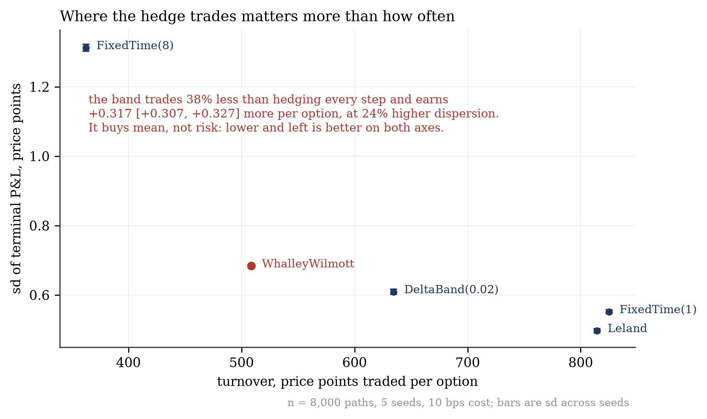
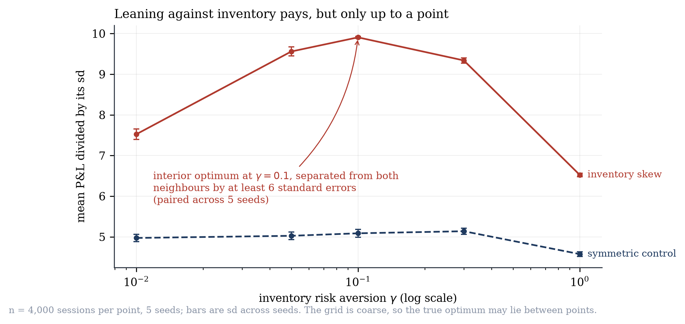
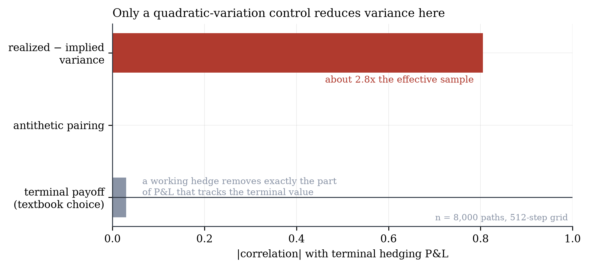

# What happens when you delta hedge a short option

Seven findings from a Monte Carlo laboratory. Every number below is produced by
`scripts/report.py`, stored in `artifacts/findings.json`, and inserted into this file by
`scripts/render_report.py`. Nothing here is typed by hand, and CI fails if the two
disagree.

<!-- BEGIN:preamble -->
All figures below: a one-year at-the-money call on a 100 underlying, zero rates
and dividends, 30% volatility, **8,000 paths on a 1024-step monitoring grid**, replicated across
**5 seeds** (11, 23, 37, 41, 53) and reported as mean +/- standard deviation over those
seeds. Every frequency in a sweep runs on the same Brownian-nested paths.

Generated by `scripts/report.py` at commit `581475f3` (3.14.3, numpy 2.5.3, scipy 1.18.1).
<!-- END:preamble -->

Figures are in `figures/`, drawn by `scripts/figures.py`, which reads only the artifact
and never recomputes anything.

## 1. Hedging error falls as the inverse square root of frequency

<!-- BEGIN:f1 -->
| rehedges per year | 9 | 1019 |
|---|---|---|
| sd of terminal P&L | 3.488 | 0.330 |

Fitted log-log slope **-0.4987 +/- 0.0024**, against the theoretical -0.5.

The uncertainty is the point of quoting it: the slope moves by about 0.002
between seeds, so any digit beyond the third is noise.
<!-- END:f1 -->

Freeze gamma over a step and write `dS/S = s*sqrt(dt)*z`. The P&L contributed by one
interval is `0.5*Gamma*S^2*s^2*dt*(z^2 - 1)`, with mean zero and, since
`Var(z^2 - 1) = 2`, variance proportional to `dt^2`. Summing `T/dt` of them gives total
variance proportional to `1/N`. This is Boyle and Emanuel (1980), and it is the engine's
primary correctness test: a sign error, a misaligned shift or a broken path generator all
move the slope off -0.5.


## 2. Hedging at realized volatility locks in the edge; hedging at implied earns the same mean far less reliably

<!-- BEGIN:f2 -->
Selling at 35% implied against 25% realized, where `BS(s_imp) - BS(s_real) = 3.9444`:

| hedged at | mean P&L | sd | P(profit) |
|---|---|---|---|
| realized | +3.9426 +/- 0.0023 | 0.2749 | 100.0% |
| implied | +3.9484 +/- 0.0094 | 1.2853 | 100.0% |

Drift is pinned to r - q (pinned), without which the two means do not agree.
<!-- END:f2 -->

Hedge with the volatility the underlying actually has and the terminal P&L converges to a
number known at inception; what stays random is the path taken to reach it, and the
residual dispersion is nothing but the discretisation error of finding 1. Hedge at implied
instead and the P&L becomes genuinely path dependent, earning the same amount on average
while varying several times as much across paths.

The pathwise sign follows `s_imp - s_real`: a short position profits when realized
volatility comes in below implied, which is why every path is profitable here rather than
merely most of them.

## 3. The P&L explain closes, and the residual measures what hedging cannot see

<!-- BEGIN:f3 -->
| term | hedged every step | hedged every 8th step |
|---|---|---|
| gamma | -5.930 | -5.930 |
| theta | +5.927 | +5.927 |
| max abs delta | 1.18e-16 | 4.817 |

The delta column is why both schedules are shown. Hedging every step at the mark
volatility makes that term **zero by construction**, not by measurement, so the
near-zero figure on the left establishes nothing on its own. At every eighth step
the same term is 4.82, and the decomposition still closes.

Residual relative to the gamma term, as the grid refines:

n=128 | n=512 | n=2048
---|---|---
0.0692 | 0.0349 | 0.0175

Third order in `dS`, so it falls by roughly half per fourfold refinement.
<!-- END:f3 -->

Gamma and theta nearly cancel, which is what a short option is: you are paid time decay to
carry short convexity, and at zero cost with implied equal to realized the two sides of
that bargain are worth about the same.

## 4. Jumps put a floor under the hedging error that frequency cannot reach

<!-- BEGIN:f4 -->
| | slope | sd ratio, dense over sparse |
|---|---|---|
| GBM control | **-0.499 +/- 0.002** | 0.095 |
| Merton jumps | **-0.087 +/- 0.004** | 0.638 |

Jump parameters: intensity 1.0/year, log jumps of mean -10%
and dispersion 15%. Terminal P&L skew -2.94 against near zero for the diffusion,
worst path -11.3 standard deviations from the mean.
<!-- END:f4 -->

Between jumps the diffusive error hedges away exactly as in finding 1. Each Poisson jump
delivers a convexity loss arriving between rehedges however close together they are, and
the variance it contributes is set by the intensity, the jump law and the horizon, none of
which depend on frequency. Total variance therefore converges to a floor rather than to
zero, which the figure above shows as a visible plateau.

The attribution says the same thing from the other side. A jump is not a small move, so
the second-order expansion cannot absorb it, and the worst single-step residual relative to
gamma is roughly twenty times larger under jumps than under the diffusion. The residual
concentrates in the one step containing the jump.

**This is the finding that matters for a crypto derivatives book.** Gap risk is not a
hedging-frequency problem and no amount of rehedging discipline converts it into one.

## 5. Under costs the optimum is a band, not a frequency

<!-- BEGIN:f5 -->
At 10 bps proportional cost:

| schedule | mean P&L | sd | rehedges | turnover |
|---|---|---|---|---|
| DeltaBand(0.02) | -0.6348 | 0.6093 | 151.8 | 634.6 |
| FixedTime(1) | -0.8252 | 0.5517 | 510.4 | 825.0 |
| FixedTime(8) | -0.3522 | 1.3123 | 64.8 | 362.4 |
| Leland | -0.8142 | 0.4972 | 510.6 | 814.6 |
| WhalleyWilmott | -0.5079 | 0.6836 | 92.2 | 508.7 |

Whalley-Wilmott against hedging every step, paired bootstrap: **+0.3168** per option,
95% interval [+0.3065, +0.3268].

On the pure frequency sweep at 60 bps the risk-adjusted objective bottoms at
**65 rehedges**, but a bootstrap over paths puts that location anywhere in
**[33, 65]**. The optimum is a region, not a point, and reporting it
as a single number would overstate what the experiment resolves.
<!-- END:f5 -->

Read the table by columns. Hedging every step buys the tightest dispersion among the
time-based rules and pays the most for it. Hedging every eighth step has the better mean
and far more dispersion. Leland, which hedges on the same schedule as the dense rule but
sizes delta at a cost-adjusted volatility, reaches low dispersion at similar cost. The band
rules dominate on the dimension that matters, spending their trades where gamma is large
instead of spreading them evenly across the calendar.



## 6. An unconstrained smile fit implies negative probabilities

<!-- BEGIN:f6 -->
Target slice verified admissible first: minimum Durrleman g = **+0.0323**,
at-the-money implied vol 57.4%, 0.10 years to expiry. With no noise the
calibrator recovers it to 0.00000 vol points.

| quote noise | unconstrained implying a negative density | constrained | refused | fit cost |
|---|---|---|---|---|
| 0.5 vol pts | 0 of 30 | 0 of 30 | 0 | -0.000 |
| 1.5 vol pts | 5 of 30 | 0 of 28 | 2 | +0.006 |
| 3.0 vol pts | 12 of 30 | 0 of 26 | 4 | +0.079 |

Both arms run the identical optimiser and differ only in the constraint set. An
earlier version polished only the constrained arm, which made this a comparison of
optimisers rather than of constraints and produced the impossible result that
constraining a fit improved it.
<!-- END:f6 -->

A slice whose implied density goes negative prices a butterfly at a negative number. It is
not a slightly worse fit; it is not a price. Imposing Durrleman's condition during the fit
rather than checking it afterwards removes every violation, and the cost in fit quality is
a few thousandths of a volatility point, far below any realistic bid-ask.

At the highest noise level several slices admit no arbitrage-free SVI fit at all. The
calibrator refuses them rather than returning something that quietly is not a price.

**How this was measured, and how it was measured wrongly first.** An earlier version of
this experiment used a target slice that was itself arbitrageable and reported 38 of 40
unconstrained fits implying a negative density. That number measured nothing: the fits were
faithfully reproducing an inadmissible target. A second version polished only the
constrained arm, so the comparison was between optimisers rather than between constraint
sets, and it produced the impossible conclusion that constraining a fit improved it. The
target is now checked for admissibility before any noise is added, and both arms run the
identical solve.

## 7. Inventory skew halves the dispersion of a market maker's P&L

<!-- BEGIN:f7 -->
| risk aversion | skew, P&L over sd | control, P&L over sd | skew peak inventory | control peak inventory |
|---|---|---|---|---|
| 0.01 | 7.52 +/- 0.13 | 4.97 +/- 0.09 | 7.2 | 10.4 |
| 0.05 | 9.56 +/- 0.11 | 5.03 +/- 0.09 | 4.8 | 10.2 |
| 0.1 | 9.91 +/- 0.03 | 5.09 +/- 0.10 | 4.0 | 10.0 |
| 0.3 | 9.34 +/- 0.06 | 5.14 +/- 0.07 | 2.9 | 9.2 |
| 1.0 | 6.52 +/- 0.04 | 4.58 +/- 0.06 | 2.1 | 6.8 |

Paired difference in mean P&L at the middle setting: **-3.030**, 95% interval
[-3.389, -2.663]. The skew costs expected P&L and buys risk.

The error bars matter here. Neighbouring risk aversions overlap, so the sweep
locates a region where skewing helps rather than an optimal value of gamma.
<!-- END:f7 -->

A dealer quotes two sides around a simulated mid, fills arriving as a Poisson process whose
intensity decays with distance. Two strategies on identical paths: quotes centred on the
Avellaneda-Stoikov reservation price, against a control quoting the same total width but
never skewed. Holding the width fixed is what makes the difference attributable to the
skew rather than to quoting wider.

Lean too little and inventory accumulates; lean too hard and the quotes are wide enough
that flow stops arriving. The sign of the skew is the whole mechanism: a long dealer must
quote a closer ask and a further bid. Inverting it turns a stabiliser into an amplifier,
and the first version of this simulation had it backwards, pinning inventory against the
position limit on essentially every path while the control stayed bounded. That is what the
control is for.



## 8. Coin-settled options need their own delta

<!-- BEGIN:f8 -->
A coin-settled call, strike 110, 0.50 years, 60% volatility. Coin price
**0.136286**, confirmed by two independent routes:

| route | estimate | separation |
|---|---|---|
| dollar payoff under Q, converted at spot | 0.137977 +/- 0.001063 | 1.59 se |
| coin payoff under the share measure | 0.136765 +/- 0.000639 | 0.75 se |

The naive quantity `E^Q[coin payoff]` is **0.079302**, which is not a
price and is not close to one. Jensen separates them.

Hedging error from converting a vanilla delta instead of differentiating the
coin price:

| spot | coin delta | converted vanilla | gap | gap |
|---|---|---|---|---|
| 60 | 0.001631 | 0.001979 | -0.000348 | -17.6% |
| 80 | 0.002995 | 0.003843 | -0.000848 | -22.1% |
| 110 | 0.003849 | 0.005434 | -0.001584 | -29.2% |
| 150 | 0.003421 | 0.005574 | -0.002153 | -38.6% |
| 220 | 0.002076 | 0.004409 | -0.002333 | -52.9% |
<!-- END:f8 -->

Crypto venues list options that settle in the coin, not in fiat. Multiplying the coin
payoff by the settlement price recovers the vanilla dollar payoff exactly, so the dollar
value of an inverse option is a vanilla option's value and its coin price is that value
divided by spot. At inception this is a change of units.

The hedge is not. Differentiating the coin price gives `Delta/S - C/S^2`, and the second
term does not vanish. A desk converting vanilla deltas by dividing by spot omits it
entirely, carrying an error equal to the option's own value over spot squared, largest
exactly where the option is worth most.

There is also a trap worth stating because it is easy to fall into. The expectation of
the coin payoff under the dollar risk-neutral measure is not the coin price. Recovering
the price means either discounting the dollar payoff and converting at today's spot, or
taking the coin payoff under the share measure, where the drift carries an extra `s^2`,
and discounting at the dividend rate. Both routes appear in the table above and agree;
the naive expectation is roughly forty percent away from either.

## Numerics

<!-- BEGIN:numerics -->
**Convergence.** Standard error of the mean against sample size:

n=1,000 | n=4,000 | n=16,000
---|---|---
0.02094 | 0.01037 | 0.00515

Fitted slope -0.506 against the expected -0.5.

**Variance reduction.** The control variate is `sum(z^2 - 1)`, which follows from
the same expansion as finding 1: correlation **-0.805**, variance ratio
**0.352**, about 2.8x the effective sample size at no cost.

Two negative results, both derived rather than discovered by tuning. The discounted
terminal payoff correlates with hedging P&L at only -0.030 and buys nothing,
because a working delta hedge removes precisely the component of P&L that tracks the
terminal value. And antithetic sampling cannot help at all: the hedging error is even
in the driving normal, so a mirrored path reproduces it exactly and the correlation
between a pair is 1.0.
<!-- END:numerics -->



## Engines

The reference engine is NumPy, vectorised over paths. A C++ core built with nanobind runs
the same experiment for geometric Brownian motion on a fixed-time schedule.

Parity is asserted in tiers, because bitwise equality is unattainable by construction
rather than by carelessness:

| tier | scope | result |
|------|-------|--------|
| exact | raw Philox uint64 and uniform doubles | bitwise identical |
| tolerance | inverse-CDF normals | 84% bitwise identical, worst gap 8.9e-16 |
| tolerance | terminal P&L | agrees to 4e-13 relative |
| bounded | rehedge decisions | 8% to 22% of paths differ, never by more than two trades |

The normals cannot match exactly because the Cephes tail branch goes through `log()`, which
is not correctly rounded and differs between libms; roughly a quarter of draws land there.
Those last-bit gaps then flip discrete decisions: where delta saturates at exactly 0 or 1,
one engine books a trade and the other does not, so the engines differ by a whole trade
rather than by a rounding error. That is why the decision tier asserts a bound rather than
equality, and why the P&L tier still agrees to twelve digits: a trade at a saturated delta
moves almost no money.

`vl bench` reports the speedup against the reference with attribution disabled, so both
engines do the same work, taking the best of several repeats after a warmup. The measured
range is roughly 1.8x to 3.4x: a scalar C++ loop does not beat a vectorised `erf` over
twenty thousand paths, and the C++ wins where the schedule is sparse because it skips the
delta evaluation on steps that do not trade.

## What this does not establish

- Every finding is measured under the model that generated the paths. Nothing here is
  calibrated to market data, so these are statements about estimators and hedging rules,
  not forecasts about any traded instrument.
- The hedged instrument is a fiat-settled vanilla. Coin-margined inverse options, which are
  what crypto venues actually list, have different greeks and are not covered.
- Heston paths and the Heston characteristic-function price are implemented and tested but
  do not carry a finding. The P&L explain holds implied volatility fixed, so its vega term
  is identically zero and the decomposition is incomplete under stochastic volatility.
- The market-making simulation marks terminal inventory at the mid with no liquidation
  cost, which flatters whichever strategy carries more inventory, and that is the control.
- The arrival parameters `A`, `kappa` and the risk aversion are chosen, not calibrated to
  any venue.
- The jump floor is established by simulation against a diffusive control, not against an
  analytic expression for the jump variance.

## Reproducing

```sh
uv sync
uv run pytest                                 # every finding has a test
uv run python scripts/report.py               # regenerates artifacts/findings.json
uv run python scripts/render_report.py        # fills the blocks above
uv run python scripts/figures.py              # redraws figures/
```

## References

- Boyle, P. and Emanuel, D. (1980). Discretely adjusted option hedges.
- Merton, R. (1976). Option pricing when underlying stock returns are discontinuous.
- Leland, H. (1985). Option pricing and replication with transactions costs.
- Whalley, A. E. and Wilmott, P. (1997). An asymptotic analysis of an optimal hedging model for option pricing with transaction costs.
- Heston, S. (1993). A closed-form solution for options with stochastic volatility.
- Andersen, L. (2008). Simple and efficient simulation of the Heston stochastic volatility model.
- Gatheral, J. and Jacquier, A. (2014). Arbitrage-free SVI volatility surfaces.
- Avellaneda, M. and Stoikov, S. (2008). High-frequency trading in a limit order book.
- Ahmad, R. and Wilmott, P. (2005). Which free lunch would you like today, sir?
