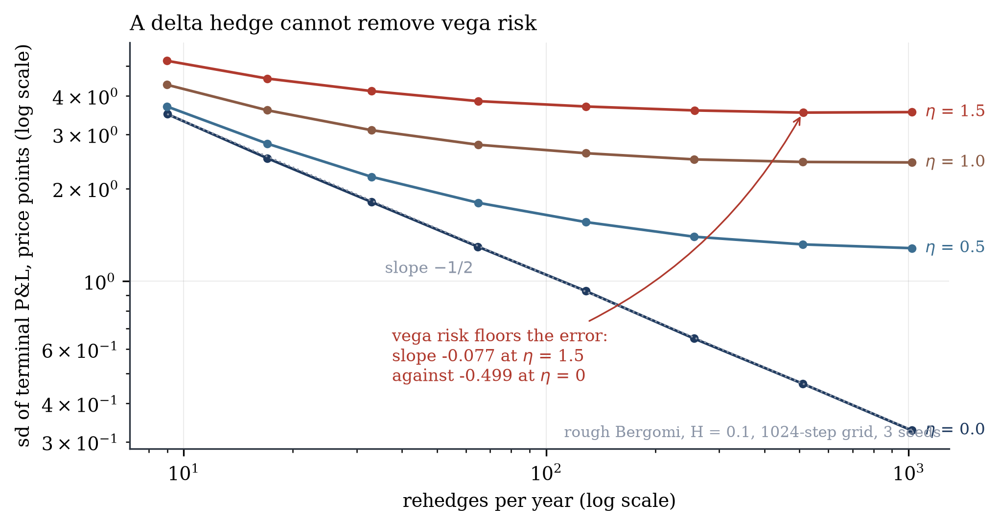

# What happens when you delta hedge a short option

Thirteen findings from a Monte Carlo laboratory. Every number below is produced by
`scripts/report.py`, stored in `artifacts/findings.json`, and inserted into this file by
`scripts/render_report.py`. Nothing here is typed by hand, and CI fails if the two
disagree.

<!-- BEGIN:preamble -->
All figures below: a one-year at-the-money call on a 100 underlying, zero rates
and dividends, 30% volatility, **8,000 paths on a 1024-step monitoring grid**, replicated across
**5 seeds** (11, 23, 37, 41, 53) and reported as mean +/- standard deviation over those
seeds. Every frequency in a sweep runs on the same Brownian-nested paths.

Generated by `scripts/report.py` at commit `09a12f38` (3.14.3, numpy 2.5.3, scipy 1.18.1).
<!-- END:preamble -->

Figures are in `figures/`, drawn by `scripts/figures.py`, which reads only the artifact
and never recomputes anything.

## 1. Hedging error falls as the inverse square root of frequency

<!-- BEGIN:f1 -->
| rehedges per year | 9 | 1019 |
|---|---|---|
| sd of terminal P&L | 3.488 | 0.330 |

Fitted log-log slope **-0.4987 +/- 0.0024**, against the theoretical -0.5.

The uncertainty is the point of quoting it: the slope moves by about 0.002
between seeds, so any digit beyond the third is noise.
<!-- END:f1 -->

Freeze gamma over a step and write `dS/S = s*sqrt(dt)*z`. The P&L contributed by one
interval is `0.5*Gamma*S^2*s^2*dt*(z^2 - 1)`, with mean zero and, since
`Var(z^2 - 1) = 2`, variance proportional to `dt^2`. Summing `T/dt` of them gives total
variance proportional to `1/N`. This is Boyle and Emanuel (1980), and it is the engine's
primary correctness test: a sign error, a misaligned shift or a broken path generator all
move the slope off -0.5.


## 2. Hedging at realized volatility locks in the edge; hedging at implied earns the same mean far less reliably

<!-- BEGIN:f2 -->
Selling at 35% implied against 25% realized, where `BS(s_imp) - BS(s_real) = 3.9444`:

| hedged at | mean P&L | sd | P(profit) |
|---|---|---|---|
| realized | +3.9426 +/- 0.0023 | 0.2749 | 100.0% |
| implied | +3.9484 +/- 0.0094 | 1.2853 | 100.0% |

Drift is pinned to r - q (pinned), without which the two means do not agree.
<!-- END:f2 -->

Hedge with the volatility the underlying actually has and the terminal P&L converges to a
number known at inception; what stays random is the path taken to reach it, and the
residual dispersion is nothing but the discretisation error of finding 1. Hedge at implied
instead and the P&L becomes genuinely path dependent, earning the same amount on average
while varying several times as much across paths.

The pathwise sign follows `s_imp - s_real`: a short position profits when realized
volatility comes in below implied, which is why every path is profitable here rather than
merely most of them.

## 3. The P&L explain closes, and the residual measures what hedging cannot see

<!-- BEGIN:f3 -->
| term | hedged every step | hedged every 8th step |
|---|---|---|
| gamma | -5.930 | -5.930 |
| theta | +5.927 | +5.927 |
| max abs delta | 1.18e-16 | 4.817 |

The delta column is why both schedules are shown. Hedging every step at the mark
volatility makes that term **zero by construction**, not by measurement, so the
near-zero figure on the left establishes nothing on its own. At every eighth step
the same term is 4.82, and the decomposition still closes.

Residual relative to the gamma term, as the grid refines:

n=128 | n=512 | n=2048
---|---|---
0.0692 | 0.0349 | 0.0175

Third order in `dS`, so it falls by roughly half per fourfold refinement.
<!-- END:f3 -->

Gamma and theta nearly cancel, which is what a short option is: you are paid time decay to
carry short convexity, and at zero cost with implied equal to realized the two sides of
that bargain are worth about the same.

## 4. Jumps put a floor under the hedging error that frequency cannot reach

<!-- BEGIN:f4 -->
| | slope | sd ratio, dense over sparse |
|---|---|---|
| GBM control | **-0.499 +/- 0.002** | 0.095 |
| Merton jumps | **-0.087 +/- 0.004** | 0.638 |

Jump parameters: intensity 1.0/year, log jumps of mean -10%
and dispersion 15%. Terminal P&L skew -2.94 against near zero for the diffusion,
worst path -11.3 standard deviations from the mean.
<!-- END:f4 -->

Between jumps the diffusive error hedges away exactly as in finding 1. Each Poisson jump
delivers a convexity loss arriving between rehedges however close together they are, and
the variance it contributes is set by the intensity, the jump law and the horizon, none of
which depend on frequency. Total variance therefore converges to a floor rather than to
zero, which the figure above shows as a visible plateau.

The attribution says the same thing from the other side. A jump is not a small move, so
the second-order expansion cannot absorb it, and the worst single-step residual relative to
gamma is roughly twenty times larger under jumps than under the diffusion. The residual
concentrates in the one step containing the jump.

**This is the finding that matters for a crypto derivatives book.** Gap risk is not a
hedging-frequency problem and no amount of rehedging discipline converts it into one.

## 5. Under costs the optimum is a band, not a frequency

<!-- BEGIN:f5 -->
At 10 bps proportional cost:

| schedule | mean P&L | sd | rehedges | turnover |
|---|---|---|---|---|
| DeltaBand(0.02) | -0.6348 | 0.6093 | 151.8 | 634.6 |
| FixedTime(1) | -0.8252 | 0.5517 | 510.4 | 825.0 |
| FixedTime(8) | -0.3522 | 1.3123 | 64.8 | 362.4 |
| Leland | -0.8142 | 0.4972 | 510.6 | 814.6 |
| WhalleyWilmott | -0.5079 | 0.6836 | 92.2 | 508.7 |

Whalley-Wilmott against hedging every step, paired bootstrap: **+0.3168** per option,
95% interval [+0.3065, +0.3268].

On the pure frequency sweep at 60 bps the risk-adjusted objective bottoms at
**65 rehedges**, but a bootstrap over paths puts that location anywhere in
**[33, 65]**. The optimum is a region, not a point, and reporting it
as a single number would overstate what the experiment resolves.
<!-- END:f5 -->

Read the table by columns. Hedging every step buys the tightest dispersion among the
time-based rules and pays the most for it. Hedging every eighth step has the better mean
and far more dispersion. Leland, which hedges on the same schedule as the dense rule but
sizes delta at a cost-adjusted volatility, reaches low dispersion at similar cost. The band
rules dominate on the dimension that matters, spending their trades where gamma is large
instead of spreading them evenly across the calendar.


## 6. An unconstrained smile fit implies negative probabilities

<!-- BEGIN:f6 -->
Target slice verified admissible first: minimum Durrleman g = **+0.0323**,
at-the-money implied vol 57.4%, 0.10 years to expiry. With no noise the
calibrator recovers it to 0.00000 vol points.

| quote noise | unconstrained implying a negative density | constrained | refused | fit cost |
|---|---|---|---|---|
| 0.5 vol pts | 0 of 30 | 0 of 30 | 0 | -0.000 |
| 1.5 vol pts | 5 of 30 | 0 of 28 | 2 | +0.006 |
| 3.0 vol pts | 12 of 30 | 0 of 26 | 4 | +0.079 |

Both arms run the identical optimiser and differ only in the constraint set. An
earlier version polished only the constrained arm, which made this a comparison of
optimisers rather than of constraints and produced the impossible result that
constraining a fit improved it.
<!-- END:f6 -->

A slice whose implied density goes negative prices a butterfly at a negative number. It is
not a slightly worse fit; it is not a price. Imposing Durrleman's condition during the fit
rather than checking it afterwards removes every violation, and the cost in fit quality is
a few thousandths of a volatility point, far below any realistic bid-ask.

At the highest noise level several slices admit no arbitrage-free SVI fit at all. The
calibrator refuses them rather than returning something that quietly is not a price.

**How this was measured, and how it was measured wrongly first.** An earlier version of
this experiment used a target slice that was itself arbitrageable and reported 38 of 40
unconstrained fits implying a negative density. That number measured nothing: the fits were
faithfully reproducing an inadmissible target. A second version polished only the
constrained arm, so the comparison was between optimisers rather than between constraint
sets, and it produced the impossible conclusion that constraining a fit improved it. The
target is now checked for admissibility before any noise is added, and both arms run the
identical solve.

## 7. Inventory skew halves the dispersion of a market maker's P&L

<!-- BEGIN:f7 -->
Mean P&L divided by its standard deviation, across risk aversions:

| risk aversion | avellaneda stoikov | glft | symmetric |
|---|---|---|---|
| 0.01 | 7.52 +/- 0.13 | 7.36 +/- 0.10 | 4.97 +/- 0.09 |
| 0.05 | 9.56 +/- 0.11 | 8.77 +/- 0.07 | 5.03 +/- 0.09 |
| 0.1 | 9.91 +/- 0.03 | 9.36 +/- 0.09 | 5.09 +/- 0.10 |
| 0.3 | 9.34 +/- 0.06 | 10.29 +/- 0.05 | 5.14 +/- 0.07 |
| 1.0 | 6.52 +/- 0.04 | 11.40 +/- 0.06 | 4.58 +/- 0.06 |

Paired differences in mean P&L, same paths:

| comparison | difference | 95% interval | |
|---|---|---|---|
| avellaneda stoikov minus symmetric | -3.030 | [-3.389, -2.663] | decisive |
| glft minus avellaneda stoikov | +2.749 | [+2.619, +2.878] | decisive |
| glft minus symmetric | -0.281 | [-0.604, +0.047] | straddles zero |

The horizon term explains it. Avellaneda-Stoikov widens as the horizon
lengthens, quoting 1.691 total at one year against 1.295 near expiry.
The steady-state form quotes 1.342 regardless, because a dealer who keeps
quoting has no horizon. The wider quote costs fills, and the fills are the edge.

<!-- END:f7 -->

A dealer quotes two sides around a simulated mid, fills arriving as a Poisson process whose
intensity decays with distance. Two strategies on identical paths: quotes centred on the
Avellaneda-Stoikov reservation price, against a control quoting the same total width but
never skewed. Holding the width fixed is what makes the difference attributable to the
skew rather than to quoting wider.

Lean too little and inventory accumulates; lean too hard and the quotes are wide enough
that flow stops arriving.

Three strategies are compared, not two. Avellaneda-Stoikov solves a finite-horizon control
problem, and its quotes widen as that horizon lengthens. Gueant, Lehalle and
Fernandez-Tapia give the steady-state closed form, which carries no horizon at all. The
difference is not cosmetic: the steady-state quotes are tighter, take more fills, and
recover the naive strategy's mean P&L while keeping most of the skew's risk control. The
horizon term in the classical formulation costs real money for no risk benefit, at least
in this setting.

The sign of the skew is the whole mechanism: a long dealer must quote a closer ask and a
further bid. Inverting it turns a stabiliser into an amplifier. **This module had that sign
wrong twice**, once in each closed form, and both times the symptom was identical, with
inventory pinned against the position limit while the never-skewed control stayed bounded.
The suite now enforces the invariant across every registered strategy, so a third cannot
reintroduce it. That is what a control and a shared invariant are for.


## 8. Coin-settled options need their own delta

<!-- BEGIN:f8 -->
A coin-settled call, strike 110, 0.50 years, 60% volatility. Coin price
**0.136286**, confirmed by two independent routes:

| route | estimate | separation |
|---|---|---|
| dollar payoff under Q, converted at spot | 0.137977 +/- 0.001063 | 1.59 se |
| coin payoff under the share measure | 0.136765 +/- 0.000639 | 0.75 se |

The naive quantity `E^Q[coin payoff]` is **0.079302**, which is not a
price and is not close to one. Jensen separates them.

Hedging error from converting a vanilla delta instead of differentiating the
coin price:

| spot | coin delta | converted vanilla | gap | gap |
|---|---|---|---|---|
| 60 | 0.001631 | 0.001979 | -0.000348 | -17.6% |
| 80 | 0.002995 | 0.003843 | -0.000848 | -22.1% |
| 110 | 0.003849 | 0.005434 | -0.001584 | -29.2% |
| 150 | 0.003421 | 0.005574 | -0.002153 | -38.6% |
| 220 | 0.002076 | 0.004409 | -0.002333 | -52.9% |
<!-- END:f8 -->

Crypto venues list options that settle in the coin, not in fiat. Multiplying the coin
payoff by the settlement price recovers the vanilla dollar payoff exactly, so the dollar
value of an inverse option is a vanilla option's value and its coin price is that value
divided by spot. At inception this is a change of units.

The hedge is not. Differentiating the coin price gives `Delta/S - C/S^2`, and the second
term does not vanish. A desk converting vanilla deltas by dividing by spot omits it
entirely, carrying an error equal to the option's own value over spot squared, largest
exactly where the option is worth most.

There is also a trap worth stating because it is easy to fall into. The expectation of
the coin payoff under the dollar risk-neutral measure is not the coin price. Recovering
the price means either discounting the dollar payoff and converting at today's spot, or
taking the coin payoff under the share measure, where the drift carries an extra `s^2`,
and discounting at the dividend rate. Both routes appear in the table above and agree;
the naive expectation is roughly forty percent away from either.

## 9. Vol-of-vol floors the hedging error, and roughness is not what does it

<!-- BEGIN:f9 -->
Rough Bergomi with H = 0.1 and correlation -0.7, hedged with a Black-Scholes delta:

| vol-of-vol eta | slope | sd dense / sd sparse |
|---|---|---|
| 0.0 | -0.499 +/- 0.002 | 0.094 +/- 0.001 |
| 0.5 | -0.222 +/- 0.001 | 0.346 +/- 0.002 |
| 1.0 | -0.117 +/- 0.002 | 0.559 +/- 0.006 |
| 1.5 | -0.077 +/- 0.002 | 0.681 +/- 0.012 |

At eta = 0 the variance is constant, the model is Black-Scholes and the square-root law
comes back. Raising it flattens the curve until rehedging faster buys almost nothing.

Roughness is not what does it. At eta = 1.5 and H = 0.45, a variance nearly as smooth as
a diffusion, the slope is -0.061 and the ratio 0.733, against -0.077 and 0.681
at H = 0.1. The floor is vega risk, and vega risk does not care how rough the variance is.
<!-- END:f9 -->

F1 measured the square-root law on a constant-volatility path, and F4 showed that jumps
floor it because a gap is not a diffusion. Stochastic volatility floors it for a different
reason, and one that survives continuous paths: a delta hedge removes spot risk, and there
is nothing in it that removes vega. Refining the rehedge grid drives the discretisation
error to zero and leaves the vega error exactly where it was.

Rough Bergomi is the model that lets the two knobs be turned separately. The variance is
driven by a Volterra process with a power kernel, so `eta` sets how much the variance
moves and `H` sets how rough its path is. Only `eta` moves the floor. This is worth
stating because roughness is usually introduced as a property that changes hedging, and
here it does not: it changes the smile, which is finding 10.

**What this does not establish.** The option is marked at a fixed implied volatility
throughout, so the whole vega move lands in the hedging error rather than partly in the
mark. A desk remarking implied volatility daily would see a smaller number and a different
distribution. The hedge also uses the Black-Scholes delta at the initial volatility, not a
model delta: a rough-Bergomi delta would hedge some of the correlation term and floor
lower.



## 10. Only a rough variance makes the short-dated skew explode

<!-- BEGIN:f10 -->
At-the-money skew, measured as the implied volatility difference across log-moneyness
+/-0.02, divided by the width, on 60,000 paths:

| maturity, years | rough Bergomi | Heston |
|---|---|---|
| 0.02 | 1.641 | 1.179 |
| 0.05 | 1.153 | 1.198 |
| 0.10 | 0.899 | 1.272 |
| 0.25 | 0.617 | 1.122 |
| 0.50 | 0.450 | 0.869 |

Fitted power law in maturity: rough Bergomi **-0.399**, Heston -0.083,
against the theoretical H - 1/2 = -0.40. A diffusive variance cannot make the short-dated
skew explode, whatever its parameters: its increments are too smooth to move the
distribution of a one-week option. Roughness can, and that is what it is for.
<!-- END:f10 -->

The at-the-money skew of a listed surface steepens as expiry approaches, and it steepens
far faster than any diffusive stochastic volatility model can reproduce. That single
observation is the reason rough volatility exists. Here it is measured rather than cited:
the same two-strike finite difference applied to both models, on the same grid, with the
same correlation and the same initial variance.

The Heston control is not a strawman with unlucky parameters. Its vol-of-vol is set high
and its correlation to -0.9, which is what a calibration to a skewed market would do, and
its skew is still nearly flat in maturity. A variance whose increments are ordinary
Brownian motion simply cannot move the distribution of a one-week option far enough.

**What this does not establish.** Five maturities, one parameter set, Monte Carlo standard
errors that grow as the maturity shrinks, and a skew measured across a finite strike width
rather than as a derivative. The exponent is recovered to within a few hundredths of
`H - 1/2`, not to four decimals, and nothing here is calibrated to a traded surface.

## 11. The free unwind was carrying the control

<!-- BEGIN:f11 -->
Unwinding costs 0.5 per unit plus 0.005 per unit squared, and informed
flow is 30% of arrivals. Mean P&L over seeds:

| setting | strategy | P&L | sd / control | unwind paid | inventory at the close |
|---|---|---|---|---|---|
| free unwind | symmetric | 67.90 | 1.00 | 0.00 | 6.7 |
| free unwind | avellaneda stoikov | 64.93 | 0.49 | 0.00 | 2.3 |
| free unwind | glft | 67.73 | 0.54 | 0.00 | 1.7 |
| unwind charged | symmetric | 64.21 | 1.00 | 3.69 | 6.7 |
| unwind charged | avellaneda stoikov | 63.72 | 0.48 | 1.20 | 2.3 |
| unwind charged | glft | 66.84 | 0.53 | 0.89 | 1.7 |
| informed flow | symmetric | 64.86 | 1.00 | 0.00 | 6.7 |
| informed flow | avellaneda stoikov | 61.60 | 0.47 | 0.00 | 2.4 |
| informed flow | glft | 64.18 | 0.53 | 0.00 | 1.8 |
| both frictions | symmetric | 61.12 | 1.00 | 3.73 | 6.7 |
| both frictions | avellaneda stoikov | 60.38 | 0.45 | 1.22 | 2.4 |
| both frictions | glft | 63.28 | 0.50 | 0.90 | 1.8 |

The steady-state quoter against the never-skewed control, paired on the same paths:

| setting | difference | 95% interval | |
|---|---|---|---|
| both frictions | +2.040 | [+1.696, +2.388] | decisive |
| free unwind | -0.281 | [-0.604, +0.047] | straddles zero |
| unwind charged | +2.544 | [+2.204, +2.899] | decisive |

The control ends the session holding several times the inventory, and in the idealised
model it hands that inventory back at the mid for nothing. Charge it what a dealer
actually pays to get flat and the ranking changes sides.
<!-- END:f11 -->

Finding 7 compared quoting rules on P&L per unit of risk and found the skewed quoters
better by a factor of two on dispersion, while the never-skewed control held its own on
mean P&L. That comparison contained a subsidy: the session ends, whatever inventory is
left is marked at the mid, and the dealer goes home. Marking at the mid is the one price
at which nobody can trade.

Charging for the unwind is one parameter and it changes the answer. The control ends the
session holding several times the inventory of either skewed quoter, so it pays several
times the cost, and the mean-P&L comparison that straddled zero moves decisively in favour
of the steady-state quoter. The dispersion result does not move at all, which is the other
half of the finding: F7 was measuring something real, and it was also measuring it in a
world that was too kind to the control.

**What this does not establish.** The unwind cost is a parameter, not a calibration: half
a tick of spread plus a quadratic term standing in for impact. A dealer who unwinds
gradually rather than at the bell pays less, and one caught in a fast market pays more.

## 12. Adverse selection costs every quoting rule the same

<!-- BEGIN:f12 -->
Mean markout per fill, 10 steps after the trade, against the mid at the
time of the fill. Negative is the market moving through the dealer's quote:

| informed fraction phi | symmetric | avellaneda stoikov | glft |
|---|---|---|---|
| 0.0 | -0.0004 | -0.0003 | -0.0001 |
| 0.3 | -0.0342 | -0.0340 | -0.0340 |
| 0.6 | -0.0680 | -0.0679 | -0.0678 |

P&L given up to the informed flow, price points per session:

| symmetric | avellaneda stoikov | glft |
|---|---|---|
| 3.04 | 3.33 | 3.55 |

The three quoting rules mark out within 0.0002 of each other and give up within 0.51
of the same P&L. Leaning against inventory is protection against holding the wrong
position, not against being picked off: the quoting rule never sees the information,
so it cannot avoid it. Anything that does has to come from the flow itself.
<!-- END:f12 -->

In the Avellaneda-Stoikov world fills are a coin flip: arrivals know nothing about where
the mid is going, so a dealer's fills mark out at zero and the only risk is holding
inventory while the price moves. Real flow is not like that, and the difference has a
name and a measurement: markout, the mid's move after a fill, signed against the dealer.

Making a fraction of the arrivals informed, so they buy from the dealer just before the
mid rises, costs money immediately. What is more interesting is that it costs all three
quoting rules the same money. Inventory skew is a response to the position, and a position
is a consequence of past fills; information is a property of the next fill, which the
quoting rule cannot see. Protection against adverse selection has to come from somewhere
else: wider quotes when flow looks informed, a shorter horizon, or not quoting at all.

That is the bridge from this repository to order-book data, where markouts are measured
rather than assumed, and where the queue decides which fills the dealer gets. The sequel
is `lob-lab`, which takes this finding as its premise: it rebuilds the Deribit book,
measures order flow imbalance after Cont, Kukanov and Stoikov (2014), and asks what
standing aside on the strength of it costs in fills. On four minutes of live data that
imbalance points the right way 59.8% of the time over the next 500 ms, decaying to 52.5%
over thirty seconds.

**What this does not establish.** The informed flow here is a tilt applied to the next
step, which is the crudest possible model of information: real informed flow arrives in
bursts, is correlated across time, and moves the price it trades against. The size of the
tilt is chosen, not estimated.

## 13. The smile's slope does not tell you how to hedge it

<!-- BEGIN:f13 -->
Standard deviation of terminal P&L, hedging a one-year call on a 256-step grid,
rough Bergomi against a GBM control:

| delta used | rough Bergomi | GBM |
|---|---|---|
| plain | 3.8080 +/- 0.1711 | 0.6557 |
| min variance | 3.6553 +/- 0.1726 | 1.2749 |
| sticky sign | 4.3944 +/- 0.1535 | 1.6313 |

The minimum-variance adjustment, at a slope of -0.0015, cuts the error by
**4.0%**. The slope the smile's shape suggests is +0.00218, from a fitted
at-the-money skew of -0.2179, and it has the opposite sign: using it raises the
error by **15.4%**.

Under GBM the implied volatility never moves, so there is no vega risk for the extra
stock to hedge and every adjustment is pure noise. That is the control which says the
gain on the rough paths is hedging rather than luck.
<!-- END:f13 -->

Finding 9 left the vega floor standing and said so. Part of that vega move is predictable
from the spot move, because the two are correlated, so a dealer can carry
`Vega * d(vol)/dS` of extra stock and remove some of it. That is the minimum-variance
delta, and the only question is what number to use for `d(vol)/dS`.

The tempting answer is to read it off the smile. Implied volatility is quoted against
log-moneyness, so if `sigma` is a function of `ln(K/S)` then `d sigma/dS` is
`-(d sigma/dk)/S`, and a smile that slopes down in strike hands you a positive number.
The step that fails is the first one: assuming the smile is glued to moneyness and slides
with spot is an assumption about dynamics, and the shape of the smile at one instant
cannot tell you that. Under rough Bergomi with negative correlation the dynamics run the
other way, spot up and variance down, and the adjustment that helps is negative.

Both numbers are measured here: the slope that minimises the hedging error, and the slope
the smile's shape suggests. They have opposite signs, and using the second one costs more
than using none at all.

**What this does not establish.** The optimum is found by sweeping one parameter on the
same model that generated the paths, so it is the best constant adjustment under this
model, not a calibration to anything traded. The gain is a few percent: most of the floor
is vega risk that no amount of stock can hedge, and removing it needs another option.

## Numerics

<!-- BEGIN:numerics -->
**Convergence.** Standard error of the mean against sample size:

n=1,000 | n=4,000 | n=16,000
---|---|---
0.02094 | 0.01037 | 0.00515

Fitted slope -0.506 against the expected -0.5.

**Variance reduction.** The control variate is `sum(z^2 - 1)`, which follows from
the same expansion as finding 1: correlation **-0.805**, variance ratio
**0.352**, about 2.8x the effective sample size at no cost.

Two negative results, both derived rather than discovered by tuning. The discounted
terminal payoff correlates with hedging P&L at only -0.030 and buys nothing,
because a working delta hedge removes precisely the component of P&L that tracks the
terminal value. And antithetic sampling cannot help at all: the hedging error is even
in the driving normal, so a mirrored path reproduces it exactly and the correlation
between a pair is 1.0.
<!-- END:numerics -->


## Engines

The reference engine is NumPy, vectorised over paths. A C++ core built with nanobind runs
the same experiment for geometric Brownian motion on a fixed-time schedule.

Parity is asserted in tiers, because bitwise equality is unattainable by construction
rather than by carelessness:

| tier | scope | result |
|------|-------|--------|
| exact | raw Philox uint64 and uniform doubles | bitwise identical |
| tolerance | inverse-CDF normals | 84% bitwise identical, worst gap 8.9e-16 |
| tolerance | terminal P&L | agrees to 4e-13 relative |
| bounded | rehedge decisions | 8% to 22% of paths differ, never by more than two trades |

The normals cannot match exactly because the Cephes tail branch goes through `log()`, which
is not correctly rounded and differs between libms; roughly a quarter of draws land there.
Those last-bit gaps then flip discrete decisions: where delta saturates at exactly 0 or 1,
one engine books a trade and the other does not, so the engines differ by a whole trade
rather than by a rounding error. That is why the decision tier asserts a bound rather than
equality, and why the P&L tier still agrees to twelve digits: a trade at a saturated delta
moves almost no money.

`vl bench` reports the speedup against the reference with attribution disabled, so both
engines do the same work, taking the best of several repeats after a warmup. The measured
range is roughly 1.8x to 3.4x: a scalar C++ loop does not beat a vectorised `erf` over
twenty thousand paths, and the C++ wins where the schedule is sparse because it skips the
delta evaluation on steps that do not trade.

## What this does not establish

- Every finding is measured under the model that generated the paths. Nothing here is
  calibrated to market data, so these are statements about estimators and hedging rules,
  not forecasts about any traded instrument.
- The hedged instrument is a fiat-settled vanilla. Coin-margined inverse options, which are
  what crypto venues actually list, have different greeks and are not covered.
- Heston paths and the Heston characteristic-function price are implemented and tested but
  do not carry a finding. The P&L explain holds implied volatility fixed, so its vega term
  is identically zero and the decomposition is incomplete under stochastic volatility.
- Findings 1 to 8 were measured with the terminal inventory marked at the mid and with
  uninformed flow. Findings 11 and 12 put both frictions back and report what changes;
  the earlier numbers are left as measured rather than quietly restated.
- The unwind cost, the informed fraction and the markout horizon are parameters, not
  calibrations to any venue.
- The arrival parameters `A`, `kappa` and the risk aversion are chosen, not calibrated to
  any venue.
- The jump floor is established by simulation against a diffusive control, not against an
  analytic expression for the jump variance.
- Rough Bergomi is simulated by the hybrid scheme and gated on the variance of its Volterra
  process, not against a closed-form price, because there is no closed-form price. The
  hedging finding marks the option at a fixed implied volatility throughout.
- The minimum-variance slope in finding 13 is swept on the same model that generated the
  paths. It is the best constant adjustment under that model, not a calibration.

## Reproducing

```sh
uv sync
uv run pytest                                 # every finding has a test
uv run python scripts/report.py               # regenerates artifacts/findings.json
uv run python scripts/render_report.py        # fills the blocks above
uv run python scripts/figures.py              # redraws figures/
```

## References

- Boyle, P. and Emanuel, D. (1980). Discretely adjusted option hedges.
- Merton, R. (1976). Option pricing when underlying stock returns are discontinuous.
- Leland, H. (1985). Option pricing and replication with transactions costs.
- Whalley, A. E. and Wilmott, P. (1997). An asymptotic analysis of an optimal hedging model for option pricing with transaction costs.
- Heston, S. (1993). A closed-form solution for options with stochastic volatility.
- Andersen, L. (2008). Simple and efficient simulation of the Heston stochastic volatility model.
- Gatheral, J. and Jacquier, A. (2014). Arbitrage-free SVI volatility surfaces.
- Avellaneda, M. and Stoikov, S. (2008). High-frequency trading in a limit order book.
- Ahmad, R. and Wilmott, P. (2005). Which free lunch would you like today, sir?
